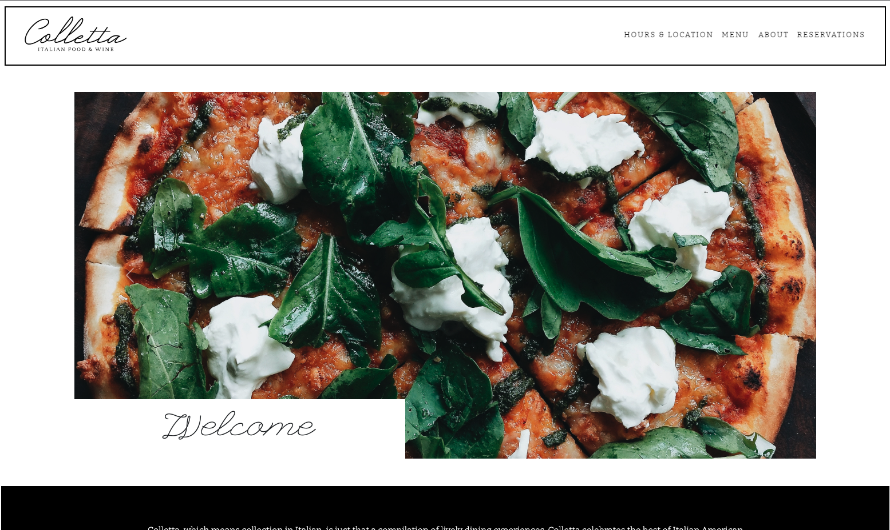
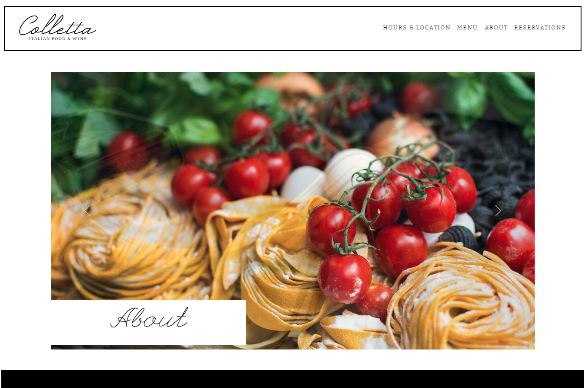
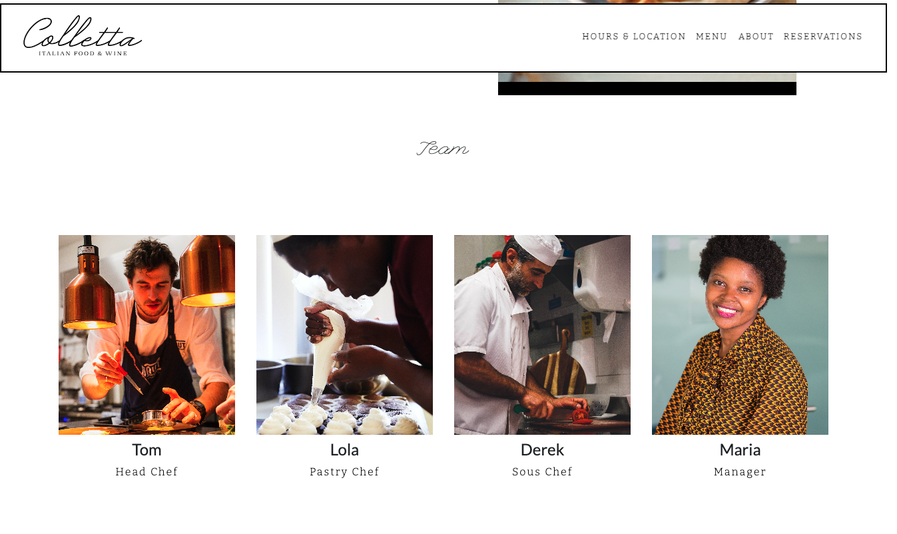
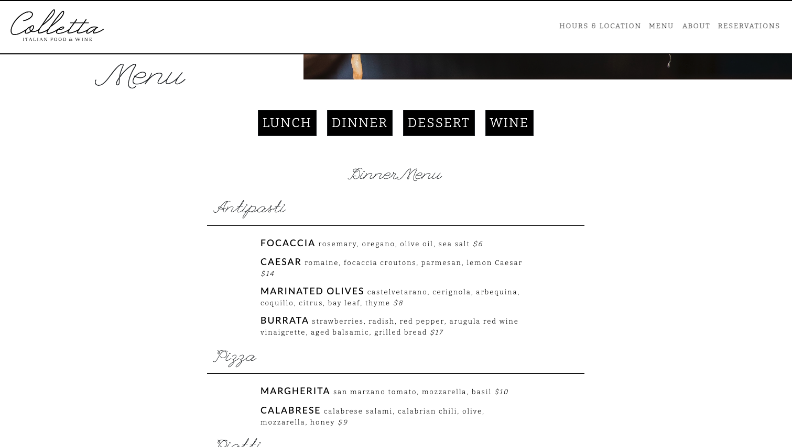
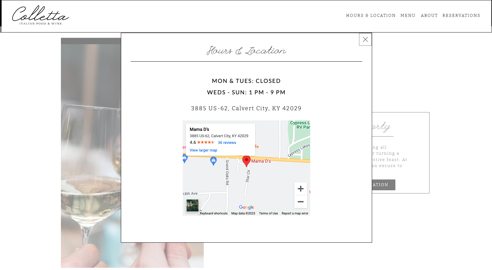
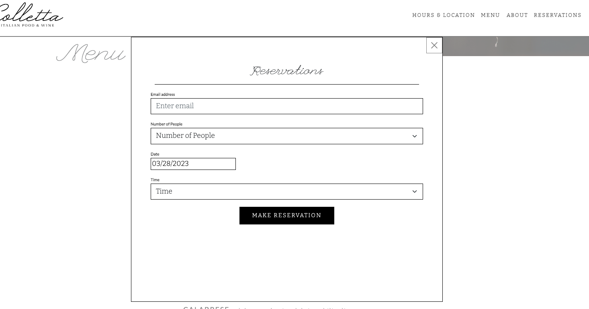

# Recreating Colletta Restaurant Website

## Description

- This Restaurant Website is a recreation of the restaurant [Colletta's website](https://www.collettarestaurant.com/) using React. 
- I love [Colletta's website](https://www.collettarestaurant.com/) design, so I used it to practice React skills by recreating it. 
- I learned more about React, JavaScript, React-Bootstrap, and responsive web design from building this site. 
- I built this site to practice my React and front-end skills.
- This website allows users to learn more about a restaurant, view their menu, see their hours and location, and make reservations.

## Usage

Visit [Restaurant Website]() to view the website.

Use the navbar to view the about page.

Click on the menu you wish to view.

View hours and location.

Make a reservation.

## Future Development 

- Create pop-up information cards for each member of the Team on the About page.
- Link reservation pop-up with Open Table.
- Make downloadable as PWA.

## Credits

- Credits for design and written content - [Colletta's website](https://www.collettarestaurant.com/)